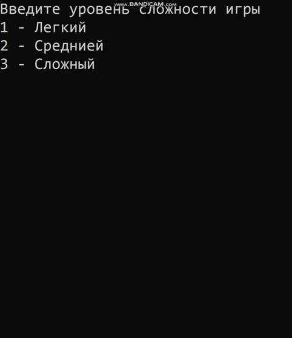

# Змейка на плюсах
---

## Используемые библиотеки

* iostream
* conio.h
* string
* time.h
* windows.h

---

В данной работе я занес работу всей змейки в один класс, а в main вызывю методы объекта класса змейки.

## Глобальные переменные
Некоторые переменные я написал снуружи, не в  функции или методе, для того чтоб доступ был к ним в любой часте программе. Также я добавил немного сахара ввиде слов остановки и начинания/изменения движения:

```c++
bool gameOver; // Переменная для окончания программы при проигрыше

enum eDirection { STOP, LEFT, RIGHT, UP, DOWN };
eDirection dir; // переменная принимающая движение в одну из сторон
int speed_snake = 200; // // Скорость для змейки
```
И так, в нашем классе будут добавлены такие поля и методы:
```c++

class snake {
private:
	int x, y;
	int fruitX, fruitY;
	int score;
	int tailX[100], tailY[100];
	int nTail = 0;

	int w = 25;
	int h = 25;

public:
    snake() {
        ...
    }
    void Setup() {
        ...
    }
    void Draw() {
        ...
    }
    void Input() {
        ...
    }
    void Logic() {
        ...
    }
```
По названиям мы уже в принципе можем понять какие методы и поля для чего нужны, опишим подробнее про конструктор и методы класса.

## Конструктор:
```c++
snake() {
    int par;
    cout << "Введите уровень сложности игры" << endl;
    cout << "1 - Легкий" << endl;
    cout << "2 - Среднией" << endl;
    cout << "3 - Сложный" << endl;
    cin >> par;
    // Change_the_difficulty, если не будет выбора, то выбор сразу будет сложным
    if (par == 1) { // Легкий режим
        this->w = 10;
        this->h = 10;
        speed_snake = 300;
    }
    else if (par == 2) { // Средний режим
        this->w = 20;
        this->h = 20;
        speed_snake = 300;
    }
}
```
Он предназначен для того чтоб создать будущее поле для нашей игры. В данном случае мы выбираем из трех видов сложности, хотя если выбор будет не 1 или 2(легкий и средний режимы), то поле по умолчанию будет большим.
Также мы меняем скорость змейки, но, мы стоит заметить что при увелечении переменной speed_snake, мы ее будем замедлять.

## Пририсовка карты, фрукта и змейки (метод Draw)
```c++
void Draw() {
    // Перерисовка картинки
    system("cls");
    // Верхняя граница
    for (int i = 0; i < w + 1; i++) {
        cout << "#";
    }
    cout << endl;
    // Боковые границы
    for (int i = 0; i < h; i++) {
        for (int j = 0; j < w; j++) {

            if (j == 0 || j == w - 1) {
                cout << "#";
            }
            if (i == y && j == x) {
                cout << "О";
            }
            else if (i == fruitY && j == fruitX) {
                cout << "&";
            }
            else {
                bool print = false;
                for (int k = 0; k < nTail; k++) {
                    if (tailX[k] == j && tailY[k] == i) {
                        print = true;
                        cout << "о";
                    }
                }
                if (!print) {
                    cout << " ";
                }

            }
        }
        cout << endl;
    }
    // Нижняя граница
    for (int i = 0; i < w + 1; i++) {
        cout << "#";
    }
    cout << endl;
    printf("Score: %i", score);
}
```
## Появление фрукта на карте и установки змейки в стоящее положение(метод Setup)
```c++
void Setup() {
    gameOver = false;
    dir = STOP;
    this->x = w / 2 - 1;
    this->y = h / 2 - 1;
    srand(time(0));
    fruitX = rand() % (w - 1);
    fruitY = rand() % h;
    score = 0;
}
```
## Создание эвентов на клавиши(метод Input)
Ну тут все очень просто, берется значение клавиши и если оно совпадает, двигает змею в нужном направлении.
```C++
void Input() {
    if (_kbhit()) {
        switch (_getch()) {

        case 'a':
            dir = LEFT;
            break;
        case 'd':
            dir = RIGHT;
            break;
        case 'w':
            dir = UP;
            break;
        case 's':
            dir = DOWN;
            break;
        case 'x':
            gameOver = true;
            break;
        }
    }
}
```

## Логика программы(метод Logic)
Логика всей программы, как движется смейка, как появляется хвост, фрукт.
```C++
void Logic() {
    int prevX = tailX[0];
    int prevY = tailY[0];
    int prev2x, prev2y;
    tailX[0] = x;
    tailY[0] = y;

    for (int i = 1; i < nTail; i++) {
        prev2x = tailX[i];
        prev2y = tailY[i];
        tailX[i] = prevX;
        tailY[i] = prevY;
        prevX = prev2x;
        prevY = prev2y;
    }

    switch (dir)
    {

    case LEFT:
        this->x--;
        break;
    case RIGHT:
        this->x++;
        break;
    case UP:
        this->y--;
        break;
    case DOWN:
        this->y++;
        break;
    }


    //
    if (this->x >= w - 1) {
        this->x = 0;
    }
    else if (this->x < 0) {
        this->x = w - 2;
    }

    if (this->y >= h) {
        this->y = 0;
    }
    else if (this->y < 0) {
        this->y = h - 1;
    }
    //

    for (int i = 0; i < nTail; i++) {
        if (tailX[i] == x && tailY[i] == y) {
            gameOver = true;
        }
    }

    if (x == fruitX && y == fruitY) {
        score += 1;
        srand(time(0));
        fruitX = rand() % (w - 1);
        fruitY = rand() % h;
        nTail++;
    }
}
```
## Запуск программы, main
В основном методе опишем основную методику игры.
```C++
int main() {
	setlocale(0, "RUS");
	snake obj;


	// Назначаем параметры игры
	obj.Setup();

	// Сама отрисовка и логика игры
	while (!gameOver) {
		obj.Draw();
		obj.Input();
		obj.Logic();
		Sleep(speed_snake);
	}

	cout << endl;
	system("pause");
	return 0;
}
```
---
## Тестирование
Протестируем же сие творение



# Заключение
Таким образом можно, зная что такое классы создать такую вот простенькую игру. 
